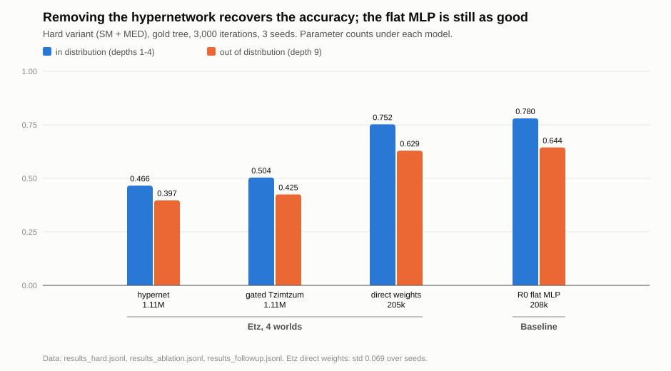
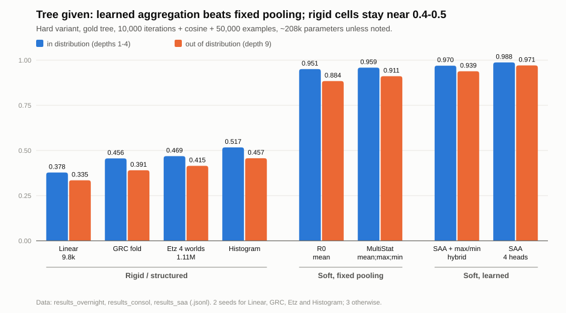
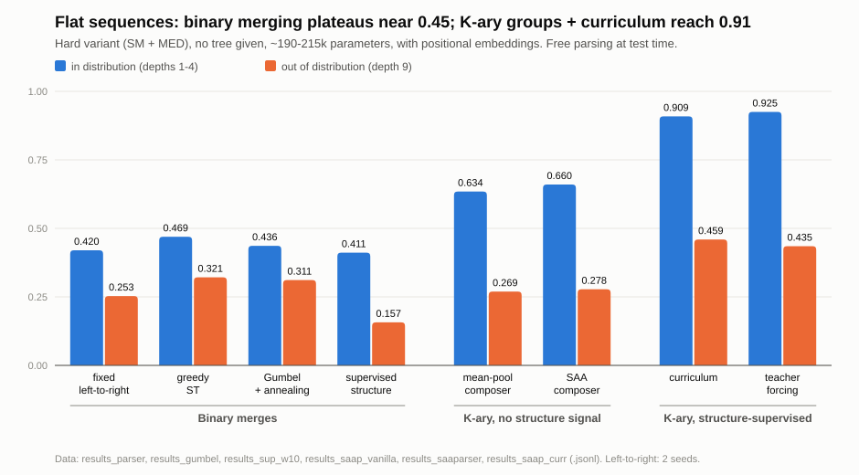
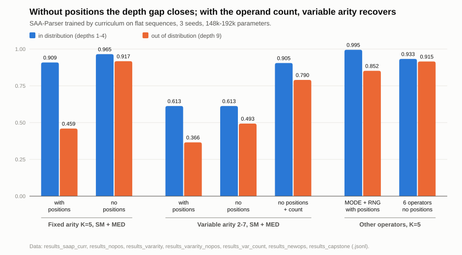

# Tree of Life AI

**From a negative result on Kabbalah-inspired inductive biases to a K-ary latent parser trained by curriculum.**

This repository started from an unusual question: can the cosmology of Kabbalah (the Tree of Life:
4 Worlds, 10 Sefirot, 22 paths, the *Tzimtzum* contraction) be turned into a competitive neural
network architecture? The short answer is no. The longer answer is the interesting part: the
architecture loses to a plain MLP, the ablations show which component is responsible, and following
each diagnosis to its fix led to two small architectures that do work on the task studied. A
literature check made afterwards shows that several of our conclusions were either already known or
too strong; it is written up in [`RELATED_WORK.md`](RELATED_WORK.md) and reflected below.

Everything here is small-scale (models of 0.15M to 1.1M parameters, one consumer GPU) and measured
on one synthetic task. Please read [What this does not show](#what-this-does-not-show) before quoting
any number.

- Paper-style write-up: [`PAPER.md`](PAPER.md)
- How it relates to published work, and which claims that weakens: [`RELATED_WORK.md`](RELATED_WORK.md)
- All tables, recomputed from the raw data: [`RESULTS.md`](RESULTS.md)
- Plans written before the runs: [`listops_experiment/plans/`](listops_experiment/plans/)

## The task

ListOps-style expressions: nested operators over digits, with a one-digit answer (chance = 0.10).

```
SM( 3, MED(1, 7, 2, 9, 4), 5, 8, 0 )   →   (3 + 4 + 5 + 8 + 0) mod 10 = 0
```

Models are trained on expressions of depth 1-4 and tested both in distribution and on deeper
expressions (depth 5 to 9). Most experiments use the "hard variant": only SM (sum mod 10) and MED
(median), which a mean-pooling model cannot shortcut. The data comes from the generator in
[`listops_data.py`](listops_experiment/listops_data.py); it is **not** the ListOps benchmark of Long
Range Arena.

## Findings

### 1. The Kabbalistic architecture loses; removing its hypernetwork recovers most of the gap

Used as a recursive cell on the syntax tree, the "Etz" (10 nodes per World, weights generated by a
hypernetwork) stays well below a mean-pooling MLP of the same size. Replacing the weight-generating
hypernetwork with ordinary parameters recovers +0.29 accuracy with about 5× fewer parameters. Once
that is done, the cosmological structure is neither better nor worse than the flat MLP.



### 2. With the tree given, learned aggregation beats fixed pooling

A cell we designed to be "theoretically optimal" (a histogram of child values) was predicted to win
and did not. What helped was making the aggregation softer and then learned: `[mean ; max ; min]`
pooling, then **SAA**, a set-attention aggregator in which a few learned queries attend over the
children.



Along the way, an apparent accuracy ceiling at 0.79 turned out to be under-training
([figure](listops_experiment/figures/fig3_training_budget.svg)).

### 3. From flat sequences: our binary parsers plateau, K-ary groups do not

When the tree is hidden and the model must choose what to merge, our four binary parsers (fixed fold,
greedy, Gumbel, structure-supervised) all land between 0.41 and 0.47, even when the correct structure
is supplied. This is a property of our small binary composers, not of binary composition: published
binary cells reach 99% on ListOps when given the tree (see [`RELATED_WORK.md`](RELATED_WORK.md)). Merging a whole group (operator + its K operands) in one step, with the SAA as composer,
reaches 0.925 with the structure supplied. With no structure signal at all it reaches 0.660; with a
**curriculum** (correct structure for the first 30% of training, then withdrawn progressively) it
reaches 0.909.



### 4. Two targeted fixes

- **Depth.** Accuracy collapsed on deeper expressions (0.909 → 0.459 at depth 9). Removing the
  absolute positional embeddings, which a local window parser does not need, gives 0.965 in
  distribution and 0.917 at depth 9.
- **Variable arity.** With 2 to 7 operands per group, accuracy drops to 0.61 even with the correct
  structure. Softmax attention averages, and an average loses how many operands there were. Feeding
  that count back gives 0.90.

A single 192k-parameter model trained by curriculum on six mixed operators, without positions,
reaches **0.933 in distribution and 0.915 at depth 9**.



## What this does not show

- **It does not show the parser beats existing methods, and published methods are ahead.** Latent-tree
  models in the literature reach 99%+ on standard ListOps *without* any parse supervision. Ours reaches
  0.660 without structure signal, on an easier custom task. No published parser was run here; the
  binary parsers used as references are our own small implementations.
- **It is not a claim of novelty.** A first literature pass was done only after the experiments
  ([`RELATED_WORK.md`](RELATED_WORK.md)). Latent-tree parsing, set attention, scheduled teacher
  forcing, multi-aggregator pooling with a count term, and dropping positions for length
  generalisation all exist. What is ours is this particular combination and the record of how we
  got there, mistakes included.
- **The hypernetwork result may be an initialisation effect.** Generated weights need a dedicated
  initialisation, which we did not use.
- **One synthetic task.** A custom generator with fixed arity, small trees and controlled depth.
  Numbers are not comparable with published ListOps results, and nothing is tested on real data.
- **The best parser results use the correct structure during training** (teacher forcing or the
  curriculum). Fully unsupervised parsing reaches 0.660, and that mode was not rerun after the
  positional embeddings were removed.
- **The curriculum was not pre-registered.** The plan written beforehand predicted that unsupervised
  parsing would reach about 0.85. It reached 0.660; the curriculum was designed afterwards.
- **Variable arity is bounded and announced**: at most 7 operands, with empty slots visible as padding
  tokens, and the result (0.90) stays below fixed arity (0.965).
- **Small scale and few seeds.** Three seeds for most runs, two for a few (listed in `RESULTS.md`);
  no significance tests. The text-modelling comparison that opens the paper is a single run per model.

## Repository layout

```
PAPER.md                      paper-style write-up
RELATED_WORK.md               first literature pass, and what it changes
RESULTS.md                    all tables + index of data files
run_sweep.py                  text tournament (Etz vs a small Transformer, Tiny Shakespeare)
etz_hachaim/research/         the original architecture (fractal worlds, hypernetwork, Tzimtzum)
models/                       language-model wrappers used by run_sweep.py
dataset/download_data.py      downloads Tiny Shakespeare
listops_experiment/
  listops_data.py             expression generator (fixed and variable arity)
  listops_model.py            all recursive cells: MLP, MultiStat, SAA, GRC-style, histogram, Etz
  listops_run.py              experiments with the tree given
  listops_parser.py           binary latent parser on flat sequences
  listops_saa_parser.py       SAA-Parser: K-ary groups, modes sup / free / curr
  listops_saa_parser_vararity.py   variable-arity variant
  make_figures.py             regenerates figures/ from the result files
  results_*.jsonl             raw results, one JSON line per training run
  plans/                      plans written before the runs (English translations)
  figures/
docs/fr/                      original French paper, experiment log and plans
```

## Running it

Requirements: Python 3.11 and PyTorch (developed with 2.5.1 + CUDA 12.1 on an RTX 3070, 8 GB). No
other dependency. A full 10,000-iteration run takes roughly 15 to 25 minutes on that card.

```bash
pip install -r requirements.txt
```

Quick check that everything works (about a minute on a GPU, longer on CPU):

```bash
python listops_experiment/listops_saa_parser.py --kinds curr --no_pos --iters 300 --n_train 2000 --n_test 200 --seeds 0 --log_every 100 --out /tmp/smoke.jsonl
```

The experiments, in the configuration used for the reported numbers:

```bash
# Tree given: compare cells at equal budget (phases 8-9)
python listops_experiment/listops_run.py --mode full --ops SM,MED --ood_depths 5,7,9 \
    --kinds R0,MultiStat,SAA_h4 --budget_ref Etz4_direct \
    --iters 10000 --cosine --warmup 300 --n_train 50000 --n_test 1000 --out my_cells.jsonl

# Flat sequences, binary parser (phase 10)
python listops_experiment/listops_parser.py --kinds l2r,soft,gumbel,sup --hidden 512 --cosine --out my_binary.jsonl

# Flat sequences, SAA-Parser (phases 11, 13, 14, 16, 17)
python listops_experiment/listops_saa_parser.py --kinds sup,free,curr --cosine --out my_parser.jsonl
#   --no_pos                         remove positional embeddings
#   --ops MAX,MIN,MED,SM,MODE,RNG    six operators
#   --curr_hold 0.1                  length of the fully guided phase
#   --cell vanilla | multistat       composer ablation

# Variable arity (phases 12, 15)
python listops_experiment/listops_saa_parser_vararity.py --kinds sup,curr --no_pos --count --cosine --out my_vararity.jsonl

# Text tournament (phases 1-3)
python dataset/download_data.py && python run_sweep.py

# Figures
python listops_experiment/make_figures.py
```

Each script appends one JSON line per finished run to `--out` and skips runs already present, so an
interrupted sweep can be restarted with the same command. Use a new `--out` name to avoid mixing your
runs with the stored results.

Two caveats on exact reproduction, detailed at the end of `RESULTS.md`: the phases run before the
MODE and RNG operators were added used a 4-operator vocabulary, and the command lines above are
reconstructed from the plans and from the stored parameter counts rather than copied from a log. They
reproduce the model sizes; for the tree-given experiments a data option such as `--p_deep` may differ
from the original runs.

## About the plans

Each major experiment has a plan stating the hypothesis and the thresholds that would count as
success or failure. In the private development repository those plans were committed before the
corresponding results (dates are given at the top of each plan). This public repository was created
afterwards with a fresh history, so the commit dates here do not prove that ordering; the plans are
included for what they say, and `RESULTS.md` states which outcomes matched them and which did not.

## How this was made

The experiments were designed, run and written up by the author working with AI coding assistants
(mainly Claude Code), which wrote most of the code and text under the author's direction. The French
documents in `docs/fr/` are the working originals; the English files are translations and
restructurings of them.

## License

MIT, see [`LICENSE`](LICENSE).
